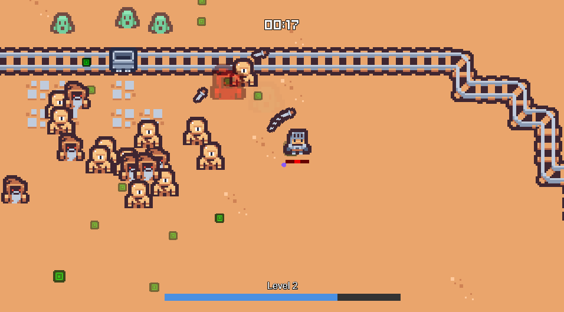

# Power Siphon

A top-down survival game where you steal abilities from elite enemies. Think Vampire Survivors meets Kirby.



## Core Concept

-   **Survive** against waves of enemies
-   **Identify** elite enemies carrying special powers
-   **Siphon** their abilities by getting close and channeling (high risk, high reward)
-   **Empower** yourself with stolen abilities
-   **Level Up** with passive upgrades from collecting XP

## Controls

| Key               | Action                      |
| ----------------- | --------------------------- |
| WASD / Arrow Keys | Move                        |
| Space             | Siphon (steal enemy powers) |

## Current Features

✅ **Player System** - Smooth movement, health, visual feedback  
✅ **Enemy AI** - Mage (ranged), Crab (tank), Ghost (phase walker)  
✅ **UI System** - Survival timer, health bar, score tracking  
✅ **Pixel Perfect** - 960x540 resolution with crisp pixel art rendering

## Enemy Types

-   🧙 **Mage** - Ranged magic attacks (30 HP, 15 points)
-   🦀 **Crab** - Tank melee enemy (50 HP, 10 points)
-   👻 **Ghost** - Fast phase walker (25 HP, 12 points)

## Development

```bash
npm install
npm run dev    # Start development server at localhost:8080
npm run build  # Build for production
```

## Requirements

-   Node.js
-   Modern web browser

## Tech Stack

-   **Phaser 3.90** - Game engine
-   **React 19** - UI framework
-   **TypeScript 5.7** - Type safety
-   **Vite 6.3** - Build tool

---

_Built with Phaser Studio template. Ready for power siphoning implementation!_
